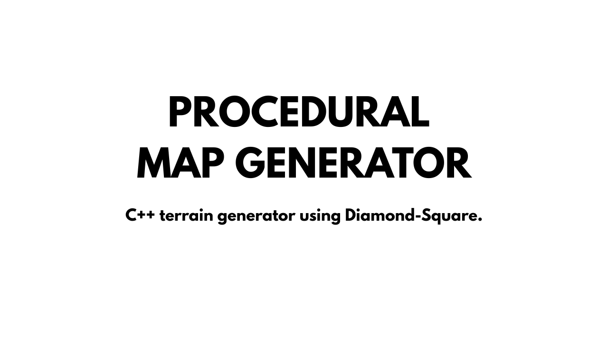

# 🌍 Procedural Map Generator

A procedural map generator using the **Diamond-Square** algorithm, written in **C++**.  
The program generates a **PPM image** representing the terrain, where each pixel corresponds to a point in the map.

## ▶️ Watch the Demo
[](https://youtu.be/ZRfbxiADyK0)


## ✨ Features
- Procedural map generation using **Diamond-Square**.
- Output saved as a **PPM image**.

## 🕑 Project History
This project is a continuation of a previous assignment developed in the course *Introduction to Programming Techniques*. The current version focuses on refactoring and adding new features.

## ⚙️ Build & Run

### Clone the repository  
```bash
git clone https://github.com/pedroguedes-cs/procedural-map-generator.git
cd procedural-map-generator
```
### Build
```bash
# Create and enter build directory
mkdir build
cd build

# Generate build files with CMake
cmake ..

# Compile the project
make
```
### Run
```bash
./bin/main
```

## ⚖️ License
This project is licensed under the [MIT License](LICENSE).
